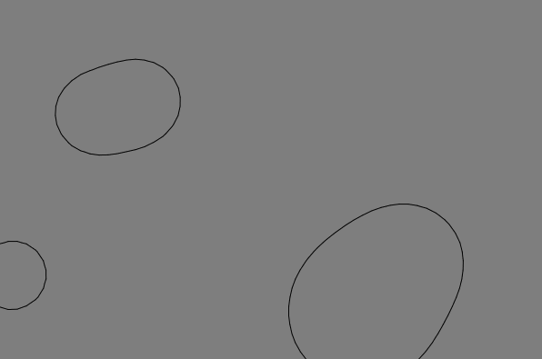
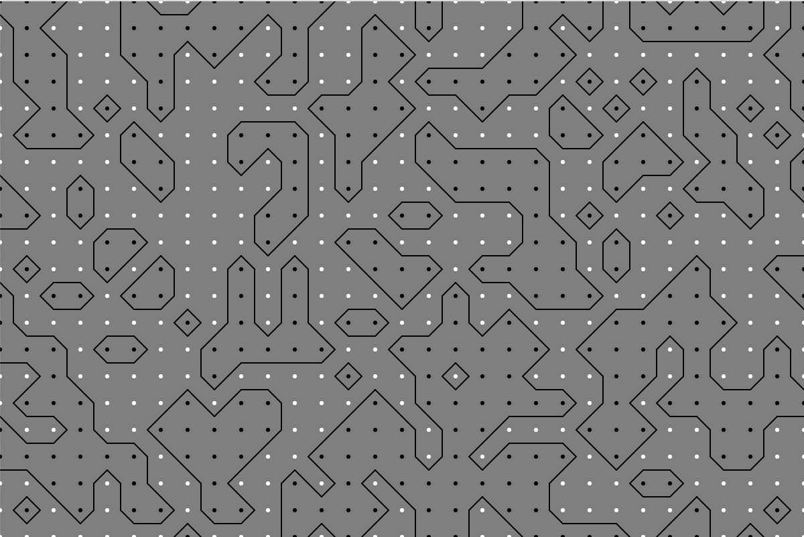

# Marching Squares implementation

Draw (using [P5.js](https://p5js.org/)) iso contours of threshold value over 2D scalar field. The contours represent an approximation of all the points which have the same value as the threshold value. The iso countours are linearly interpolated.

Example:
 - "meta balls" (not smooth due to gif capture)
 - draw iso contour of threshold in dynamicly changing field
 - field values change as a function of distance from the moving "meta balls"

 

Example:

- countours weaving in between field points valued at 1 or 0
- threshold = 0.5
- 2D scalar field values generated randomly

## Thanks

[The Coding Train!](https://www.youtube.com/watch?v=0ZONMNUKTfU)

[Jamie Wong!](http://jamie-wong.com/2014/08/19/metaballs-and-marching-squares/)

[Marching Squares Wiki article!](https://en.wikipedia.org/wiki/Marching_squares)
